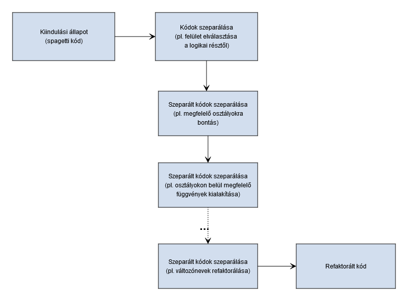
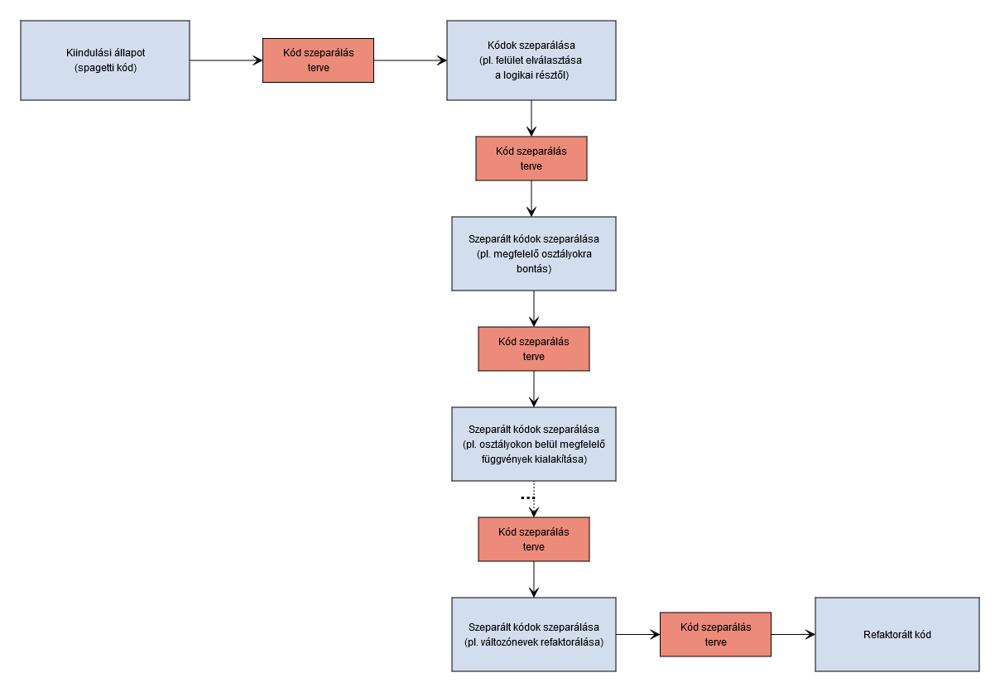

# Spagetti kód refaktorálása

Próbáljunk meg rossz kódból előállítani egy jó kódot. A programozásban minden feladatot számtalan módon megvalósíthatunk, itt ezek közül mutatok be egyet.

## Kiinduló probléma
Adott az [SRP\Hanoi\Program\MAF.EKE.SRP.HanoiDemo](https://github.com/malbertHE/EKECodingDodjo/tree/master/Principle/SRP/Hanoi/Program/MAF.EKE.SRP.HanoiDemo) projekt. Ez a projekt egy Hanoi demót valósít meg négy koronggal konzolos felületen. A feladat csupán annyi, hogy tovább kell fejleszteni a demót úgy, hogy a felhasználó adhassa meg a korongok számait 1 és 15 között, ahol minden korong színe más, ill. fekete színű nem lehet a korong. Fontos, hogy a konzolon futó demó továbbra is megfelelően működjön (pl. ne essen szét a demó a konzolos ablakon, ne csússzon ki a látható képernyőről stb.), bármilyen számot is ad meg a felhasználó a megengedett intervallumban. A feladatot nehezíti, hogy ez egy **rothadó kód** vagy más néven **spagetti kód**.<a href="#fn1" id="fnref1">[1]</a>

## A megoldás elmélete

Mivel a korongok számát egy változó tárolja, ami jelenleg 4-re van állítva, adná magát a lehetőség, hogy ennek a változónak az értékét változtassuk meg, pl. 5. korong esetén 5-re. Ez viszont egy rothadó kód, ahogy ezt megpróbálnánk, máris szétcsúszna a konzolos ablak. Azt kell ilyenkor észrevenni, hogy elengedhetetlen a refaktorálás. Ebben a kicsi példában akár azt is megtehetjük, hogy újraírjuk az egészet, betartva az elveket, de mivel jellemzően nem ilyen apró feladatokon kell dolgozni, ezért, hogy a valósághoz közelítsünk itt is a refaktorálást választjuk.
> Megjegyzés: **Összetettebb kódok javítása a megfelelő refaktorálási technikák nélkül elég nehéz.** Nagyon könnyen átírhatunk olyan kódot, amitől valami más fog hibásan működni. Az itt vázolt megoldással lesz egy probléma, ami szükségessé tesz egy új technika bevezetését (*TDR*). Ezt a következő példában vázolom, itt most csak az a cél, hogy valamilyen menetet találjunk arra, hogy a spagetti kódot valahogyan javítsuk.

**Az egyik legfontosabb lépés mindig az, hogy a felületet leválasszuk a logikáról.** Nagyobb programoknál ennek a két rétegnek élesen el kell határolódni egymástól. Ugyanezzel a logikával a szétválasztott részeket tovább bontjuk. Ezekben a műveletekben az a cél, hogy minél kisebb egységekre tudjuk felbontani. Ha elkülönültek egymástól az általuk elvégzett feladatok átláthatóbbá válnak. Így könnyebb eldönteni, hogy mely részeket kell külön osztályokba szervezni és melyeket kell tovább bontani. Itt kap nagyon fontos szerepet az **SRP**<a href="#fn2" id="fnref2">[2]</a>, vagyis az egy felelősség - egy osztály alapelve.

Egy refaktorálás lehetséges menete:

A fent vázoltakat leírni nagyon egyszerű, de a valóságban nagyobb spagetti kódok teljes refaktorálásakor ezt sokkal nehezebb végrehajtani. Szükségünk van még egy nagyon fontos lépésre, a tervezésre. Ész nélküli refaktorálás nem biztos, hogy a megfelelő irányba visz el. Ahhoz, hogy megkönnyítsük a dolgunkat minden refaktorálás elé egy tervezést kell beszúrni. Meg kell tervezzük, hogy adott állapotból hová szeretnénk eljutni. Ezek alapján így bővül a táblázatunk:

A fent vázolt refaktorálási technikából most már látszik, hogy mi hiányzik. Nem tudjuk biztosítani az egyes refaktorálási fázisok között azt, hogy a kódunk még mindig megfelelően működik. Ezért fogjuk a következő példában ezt a refaktorálási technikát kiegészíteni a TDR technikával.
> Megjegyzés: Fontos látni a terv és a teszt szükségességét. A terv az utat mutatja amerre haladni kell, a teszt biztosít minket arról, hogy oda is értünk. A lenti megoldásban, ahogy arról már volt szó, se a tervezés, se a tesztelés nem lesznek bemutatva. Itt most csak a nyers refaktorálásra koncentrálunk.

Az elméleti rész után lássuk a konkrét példát.

## A megoldás
A megoldás lépéseinek értelmezéséhez tanulmányozd a kiinduló forrást és a refaktorált forrást.

1. Az első lépés, hogy a felületet elválasztjuk a logikától. Ha az lett volna a feladat, hogy a felületet cseréljük le grafikus felületre szintén nem tudtuk volna megtenni, mert a felület és a logika egy osztályban van megvalósítva. 
  - Készítünk egy könyvtárat, hogy oda át tudjuk majd tenni a logikát. A fenti megoldott példában ez a MAF.EKE.SRP.Hanoi projekt.
  - Ha elkészítettük a logikát megvalósító projektet, akkor hozzunk létre benne egy Hanoi osztályt.
  - Hozzuk létre a konstruktort, ami 1 paramétert vár, a korongok számát, amit elmentünk egy privát mezőbe, de olvasásra publikussá tesszük (property).
2. Az osztály működését többféle képen is megvalósíthatnánk. Mi most az egyszerűség kedvéért azt a megoldást választjuk, amikor a konstruktor már előre kiszámolja a lépéseket és eltárolja, hogy a továbbiakban csupán információszolgáltatást nyújtson. Szerencsére a programunk nem annyira rothadó, a logika nagy részét 2 függvény végzi el, ezeket fogjuk áttenni. Ez a két függvény az eredeti kódban a Hanoi és a HanoiA. 
  - Ezeket emeljük át a logikai részbe.
  - A Hanoi függvényt átnevezzük CalcHanoi névre.
  - A függvények ne legyenek statikusak, a static kulcsszót töröljük.
3. A Tuple osztályok használatát meg kell szüntetni. Ez szembe megy a **GOF1** alapelvvel és Bob bácsi se szereti ha egy változónak a nevéből nem derül ki, hogy ő mi is pontosan, márpedig a Tuple által egybefogott változókhoz csak típus van megadva vagyis nincs nevük. 
  - Létrehozzuk a Step osztályt, amivel majd kiváltjuk a Tuple osztályt. A Step osztály megvalósítását megtalálod a Step.cs fájlban.
  - A Hanoi.cs fájlban lecseréljük a Tuple osztályt mindenhol Step osztályra.
4. A konstruktorban meghívjuk a CalcHanoi függvényt, de a visszatérési értékét egy privát változóba eltároljuk.
5. A CalcHanoi függvény által kiszámolt és privát változóba mentett listát publikáljuk kifelé a StepList változóban, ami egy IReadOnlyList típusú változó. Ezt is többféle képen megoldhattuk volna, mi itt most így oldottuk meg azt, hogy a privát listához ne férjenek hozzá, de azért az adatokat le tudják kérdezni. 

Eddig a logikát sikeresen leszakítottuk a felületről. Ez volt a könnyebb rész. Mivel a HanoiDemo projektbe itt most nem lehet beleírni, mert ez maga a feladat, ezért létrehoztam egy [HanoiDemo2](https://github.com/malbertHE/EKECodingDodjo/tree/master/Principle/SRP/Hanoi/Program/MAF.EKE.SRP.HanoiDemo2) projektet a Program mappába, amibe átmásoltam a HanoiDemo megvalósítását és így a továbbiakban a HanoiDemo2 kódot refaktorálom, vagyis a refaktorált felület itt tekinthető meg. Akkor lássuk a további lépéseket.

6. A Hanoi és a HanoiA függvényekre már nincs szükség itt ezért ezeket töröljük, de ez még nem elég, mert a Main hivatkozott a Hanoi függvényre. A HanoiDemo2 referenciájához hozzáadjuk a MAF.EKE.SRP projektet, majd a Main-beli függvény hivatkozás előtt létrehozzunk egy Hanoi példányt, valamint a hivatkozást átírjuk, hogy most már a Hanoi példánytól vegye az adatokat. Ez még mindig nem elég a ResultList változónk itt még Tuple típusú. Javítjuk mindenhol, hogy Step típusú legyen és a ResultList változót töröljük.
7. Azt találjuk a kódban, hogy az általunk megszüntetett ResultList változót Count értékét is felhasználták. Ezt javíthatnánk úgy, hogy a Hanoi példány LepesekListája változó Count-ját használjuk fel, de ezzel megsértenénk **Demeter törvény**ét<a href="#fn3" id="fnref3">[3]</a>, ezért a Hanoi osztályt bővítjük úgy, hogy legyen LépésekSzáma propertyje, ami ezt az adatot adja vissza.
8. Nagyon jó, hogy elkészítettük a LépésekListája változót a Hanoi osztályban, de valójában ezt az osztályt konténer osztályként kell használjuk, ezért kap egy kis kiegészítést.

A programunk ismét teszi a dolgát, csak a logikai részt már kiszerveztük. Viszont a korongok számát még mindig nem lehet növelni. Ehhez további refaktorálás szükséges, melyekből most az következik, hogy a Hanoi példányt kitesszük privát osztályszintű változóvá, hogy a többi függvény is elérhesse.
Kezdjük el a Main függvény refaktorálását. 

9. Először is a main elején rakjuk rendbe az ablakot. Töröljük a konzol ablakot, majd írjuk ki, hogy hány korongos Hanoi tornyai demó fut éppen.10. Kezdenünk kell valamit azzal is, hogy ha futás közben átméretezik az ablakot, akkor szétesik minden. Ez ellen kétféle képen védekezhetünk. Vagy letiltjuk az ablak méretezhetőségét, vagy minden kirajzolásnál a teljes képernyőt újra rajzoljuk. Mindkettő teljesen más megoldást kíván. Mi most a képernyő méretezésének letiltását választjuk.<a href="#fn4" id="fnref4">[4]</a>
11. Hogy a kód esztétikumon is javítsunk a korongokSzama változót refaktoráljuk numberOfDisks változóra.
12. A képernyőt átrendezzük. Bal oldalra kirajzoljuk a korongokat. A kirajzoló for ciklust kiszervezzük egy DrawDisks függvénybe és a függvény hívását áthelyezzük közvetlenül a címsor kiírás alá.
13. Ahhoz, hogy ismét helyesen működő kódot kapjunk, kénytelenek vagyunk az eddig bal oldalra kiírt lépés információkat megszüntetni. Ezt ideiglenesen kivesszük a kódból. Majd a későbbiekben ismét szükség lesz rá, kicsit módosítva.
14. Húzunk egy vonalat a disk leíró rész és a demó rész közzé, hogy kicsit elkülönüljenek. A vonalrajzoló részt egyenlőre a DrawDisks függvénybe helyezzük.

Ha most lefuttatjuk a kódot, akkor majdnem jók vagyunk, leszámítva három apróságot. Ezeket a következő 3 lépésben tesszük rendbe.
15. Kezdjük a demó kezdőállapotának felrajzolásával. A három rúd és a korongok felrakása kezdő állapotba részt kiemeljük egy függvénybe (DrawInitialState) és meghívjuk a disk kirajzoló függvény után. Ez még nem elég, eddig a kirajzolás statikus volt, de most különböző méretű diskjeink lehetnek, ezért ennek a függvénynek a működését a megfelelő dinamizmussal látjuk el.
16. A második nagy probléma, hogy mivel a lépések kiírását kiszedtük, ezzel együtt megszüntettük a ResultText változó feltöltését is. A Demo függvény viszont számít erre. Ideiglenesen a Demo függvényből is kiszedjük, hogy a program továbbra is fusson.
17. A következő probéma nem is olyan apróság. **Mivel a Demo függvény rekurzív, ezért 15 korong esetében már StackOverflowException hibát kapunk. Ez is egy intő példa, hogy rekurzióval csak óvatosan.** Nekünk itt most meg kell szüntetni, tehát a rekurziót átírjuk ciklusra. Ezt szerencsére viszonylag fájdalom mentesen megtehetjük.
Miután mindezzel végeztünk. Eljutottunk abba az állapotba, hogy ismét működik a kis bemutatóprogram, de még sok minden van hátra. A kód még mindig nem jó és a lépések kiírása is megszűnt. A következőkben a lépések számának ismételt kiírását oldjuk meg.
18. Hogy legyen hova kiírni, a demó részt kicsit lentebb toljuk, hogy a fenti részre legyen hely kiírni az aktuális lépést.
19. A rudak fölé kiírjuk mindig az aktuális lépést.
20. A következő lépés, hogy elindítjuk a demót.
21. Hogy a programunk ne legyen ennyire statikus, átírjuk, hogy a felhasználó adhassa meg a korongok számát a megadott keretek között (SetNumberOfDisks függvény). Ezt is kiszervezzük egy függvénybe, amit a Main elején hívunk meg. 

A Main függvényt most már szépen kitisztíthatjuk. A SetNumberOfDisks hívás maradhat a Main elején, az InitConsole függvényt és az utána következő cím kiíró részt helyezzük ki egy InitDrawHanoi függvénybe. Ez még nem elég. Még mindig vannak problémák, folytassuk a refaktorálást: 

22. A Demo függvényt nevezzük át RunDemo függvényre.23. Szedjük ki a függvény végéről a fölösleges sortörést és az egykori lépéseket kiíró részt, amit már előzőleg kiremeltünk a kódba, csak még bent hagytuk amíg meg nem írtuk az új lépéskiírót. Mivel az már kész erre biztosan nincs szükségünk és **alapszabály, hogy "halott" kód nem lehet az élők között**. Ami meghalt, azt temessük el és töröljük ki.
24. A Main függvényünk most már szépen olvasható. Egyedül az abc tömb érthetetlen ott. Ezt tegyük át a RunDemo függvénybe, úgyis ő használja csak.
25. Van még egy olyan hibánk, hogy ha nagyon kevés korongot adunk meg, akkor, mivel az ablak ennek függvényében dinamikus, túl kicsi lesz és nem fér ki a lépés kiírása. Ezért az oldal minimális szélességét állítsuk be úgy, hogy minden esetben elég széles legyen. 

A programunk működik, a megadott feltételek mellett, de a kódunk még nem tiszta! A Main szép és olvasható, ahogy Bob bácsi szeretné, de nézzük át a többi függvényt is, mert itt vannak még gondok.
A SetNumberOfDisks függvény szintén olvasható és szép, az InitDrawHanoi is, de a DrawDisks függvényben megjelentek valami **mágikus számok**<a href="#fn5" id="fnref5">[5]</a>. Ezeket meg kell szüntetni. **Úgy tudjuk a literálokat megszüntetni, ha nevesített konstansokat készítünk belőlük. Ezzel növeljük a kód olvashatóságát.** Az első ilyen mágikus rész az i2+1. Ez így elsőre érthetetlen. Nem szabad a kódba hagyni az ilyen mágikus számokat, mert az a cél, hogy a kód minél gyorsabban és könnyebben legyen olvasható. Tanulmányozni kell a kódot, hogy érthetővé váljon, ha pedig tanulmányozni kell, akkor nehezen olvasható és érthető. 

26. Mi is ez az i2+1? Az i\*2+1 a mindenkori korong mérete. Úgy határoztuk meg a korongok méretét a rajzoláshoz, hogy a korong sorszáma hosszú legyen a rúd mindkét oldalán, ill. a rudat is eltakarjuk, ő a + 1. Tehát ez egy függvény kell legyen. Megadjuk a korong számát és adja vissza a korong méretét. Létrehozzuk a GetDiskSize függvényt és mindenhol a kódban ezt használjuk fel, ahányszor csak egy disk méretét akarjuk meghatározni.27. A következő mágikus szám a 24. Ez gyakorlatilag a konzol sorainak szám - 1. Erre nem készítünk külön konstanst, de a konzol sorainak számára, ami 25 igen, egyrészt azért, mert több helyen is felhasználjuk, másrészt azért mert így olvashatóbb lesz a kód.
28. Most a 15 jön. Ez a bal oldalon lévő korong információs sáv szélességének statikus része. A dinamikus részével együtt alkotják ennek a sávnak a szélességét, ezért erre is készítünk egy függvényt, DisksInfoBoxWidth néven. Így ismét olvashatóbb lesz a kód.
29. Sokat javult a DrawDisks függvényünk, de még nem tökéletes (a tökéletest soha nem érjük el sehol, de törekszünk rá). Ha belenézünk a függvénybe, akkor két ciklus van benne. Semmi közük egymáshoz és ráadásul több mint egy másodpercig néznie kell még egy gyakorlott programozónak is, hogy kapcsoljon, vagyis nem olvasható mint egy könyv. Éppen ezért a két ciklust kiszervezzük két függvénybe. Az elsőt DrawDisksInfo névvel a másodikat pedig DrawSeparatorVerticalLine névvel. A DrawDisks függvényünket ettől olvashatóbbá már nem tehetjük, csupán két függvényhívás van benne, beszédes nevekkel.
30. A DrawSeparatorVerticalLine függvényben még van egy kis optimalizálási feladatunk. A DisksInfoBoxWidth függvényünk értékét egy ciklusban kérjük le. Felesleges minden ciklusban elkérni. Készítünk egy segédváltozót amit feltöltünk a ciklus előtt és azt használjuk.

Következik a DrawInitialState függvény. Itt megint sok dolgunk lesz. Ha megnézzük a függvény tartalmát, azt látjuk, hogy három jól elkülöníthető részből áll. Az első részben mágia zajlik, sok-sok mágikus számmal és értékadással, eléggé érthetetlen módon. Tipikusan ezek azok a részek, amiken egy-egy projekt spagetti kóddá és egyben kezelhetetlenné válik. A változók ugyanis osztályszintűek, amiket majd más osztályok is használnak. Pl. az f az mi és miért 6-osra van beállítva? Egyáltalán nem olvasható, mert mi nem mágusok vagyunk, hanem programozók. A mágusok az egy másik kaszt, ők nem programoznak. 

31. A teendőnk az, hogy ezt a részt rendbe tesszük. Első körben kiemeljük a varázslatos részt egy InitVariables függvénybe. Lehetne neki jobb nevet is adni, ha kitalálunk egyet, akkor egy egyszerű refaktorálással átnevezhetjük, de most megelégszünk vele.32. A második rész a rudak kirajzolását végzi. Ezt tegyük át egy DrawRods nevű függvénybe.
33. A harmadik rész a korongokat teszi fel kezdő állapotba. Ezt egy DrawDisksInitialState függvénybe tesszük ki.

A DrawInitialState függvényünk most már szép, csak három függvényhívásból áll, de a létrehozott függvényeken van mit javítani. Kezdjük az InitVariables függvénnyel. 

34. Itt van egy l változó, ami nem is itt kell legyen. Így nem is fordul a kód. Tegyük a helyére. Ezért **célszerű változókat ott létrehozni ahol használják őket** és nem több sorral fentebb.35. Az InitVariables függvény nem nagy viszont teljesen érthetetlen. Vannak benne érthetetlen nevű változók és mágikus számok. Igazából annyira spagetti az egész, hogy egy kis újratervezést igényel. Ha megnézzük a hátralévő függvények kódjait, akkor azt látjuk, hogy szükség van a három rúd x pozíciójára. Ezért hozzunk létre 3 osztályváltozót rodXPositionA, rodXPositionB, rodXPositionC névvel és inicializáljuk őket a helyes értékkel.
36. A DrawRods függvényben a SetCursorPosition függvény x pozíció megadásához ezeket az új változókat használjuk fel, az ott lévő mágia helyett.
37. A RunDemo módba is fel van használva az x változó. Itt is a SetCursorPosition függvényhez használja, olyan mágiával ami már éget. A legjobb, ha a ToronyIndex függvényt lemásoljuk és a másolatot átnevezzük GetRodPosition-ra, valamint a belsejét úgy írjuk át, hogy már ő maga a megfelelő oszlop pozíciót adja vissza. Így megszűnik a mágia és nem lesz szükség többé az x változóra se.
38. Az előbbi refaktorálással a d változót is fölöslegessé tettük. Ezt is kiszedjük a kódból.
39. Az f változóban a rudak tetejének pozícióját tároljuk, vagyis a rudakhoz tartozó y koordináta felső értékét, ezért átnevezzük rodTopY-ra.

Az InitVariables is olvasható most már, következik a DrowRoads. 

40. Az első amit megtehetünk, hogy az A, B, C literálokat lecseréljük, hiszen van is hozzá konstansunk, A, B és C néven.41. Az A, B, C nevek nem konstanshoz illőek, ezért javítunk rajta és c_RodNameA, c_RodNameB és c_RodNameC-re nevezzük.
42. Aztán van egy l változónk, ami + 3 + 5 + az egész így érthetetlen értékkel van inicializálva. Ez az l a rúd magasságát tárolja, ezért átnevezzük rodHeight-re és javítjuk, hogy csak 1-el legyen magasabb mint a korongok száma.
43. A DrawRods még mindig elég nagy, de ha átnézzük a tartalmát, akkor látszik, hogy ő is két részből tevődik össze. Egyrészt a rudak nevének kiírásából, másrészt a rudak kirajzolásából, ezért emeljük ki ezeket is két függvénybe: WriteRodNames és DrawingRods.
44. A DrawDisksInitialState már eléggé letisztult, de van benne egy mágia: i \* 2 + 1. Ez nem más mint a korong szélessége, de erre már van függvényünk, ezért javítsuk ezt ki.
45. Van még a RunDemo metódus. Itt első körben vegyük ki a fölöslegesen kikommentezett részeket, már nincs szükség rájuk.
46. Itt is megszüntetjük a mágikus számokat.
47. Az abc tömböt senki más nem használja, ezért behozzuk ide a deklarációját és adhatunk neki egy jobb nevet, de itt most mellőzük, mert nem jut eszembe jobb név.
48. Az oszlopok nevei a logikai részhez tartoznak, ezért azokat is áttesszük. (Ezt onnan tudhatjuk, hogy ott is használtuk az 'A', 'B', és 'C' neveket.)
49. A ToronyIndex-et átnevezzük GetRodIndex-re.
50. A RunDemo túl nagy, szétszedjük több részre. Először is az információs szöveg elejének kiírását kitesszük egy WriteInfoTextBegin metódusba.
51. A lépések kiírását kitesszük egy WriteStepInfo metódusba.
52. Az aktuális Disk törlését kitesszük egy ClearActualDisk metódusba.
53. A törölt korong visszarajzolása a megfelelő rúdra részt pedig kitesszük a DrawActualDisk metódusba.

A RunDemo függvényünk most már tűrhetően néz ki, de a két új függvényen még szépíthetünk kicsit.

54. Optimalizáljuk az egészet sebességre. Mivel a program kicsi, ezért memóriára fölösleges optimalizálni (nem mintha itt most sebességre túl sok értelme lenne, hiszen még várakozást is beiktatunk, de a példa kedvéért ezt most megtesszük.). Annyit tehetünk ez ügyben, hogy minden számítást csak egyszer végzünk el és segédváltozókba tároljuk őket. 

Utolsó lépésként rakjuk olvasási sorrendbe a függvényeket, ahogyan Bob bácsi javasolja, de ezt én itt most nem teszem meg, hogy láthatóvá váljon mennyivel olvashatóbb lett a Main, vagyis a program. Természetesen tovább lehetne még refaktorálni, van bőven mit, de mostanra már elértünk egy viszonylag olvasható és könnyen továbbfejleszthető kódot. Ha valakinek a kódja a végére nem így néz ki, nincs semmi gond, sokféle utat be lehet járni, a lényeg csak annyi, hogy teljesítsük a feladatot.

## Végeredmény
A két programot, ha összehasonlítjuk, akkor azt látjuk, hogy az eredeti kisebb. Kevesebb sorból áll és csak egy projektből. Ezzel szemben a másik a sok függvény és két projekt miatt mintha bonyolultabb lenne. De abban a pillanatban, hogy olvasni akarjuk a kódok tartalmát, a refaktorált kód nagyságrendekkel olvashatóbb. A függvények nevei beszédesek, kiolvasásukkal már értjük is, hogy mit is csinál az a függvény. A függvények annyira kicsik és átláthatók, hogy még egy kezdő programozó is gyorsan megérti azok tartalmát. Ezen kívül van még egy nagy előny. Sokkal gyorsabban továbbfejleszthető. Ebben a példában ugyan a logikai rész nagyon kicsi, de még itt is látható az, hogy a refaktorált kód felületének lecserélésével, (pl. WPF felület), nem szükséges a logikai kód változtatása. Vagyis a logikai kód újrahasznosítható, miközben betartja a GOF1, GOF2, és SRP elveket. Az eredeti spagetti kód viszont használhatatlan egy WPF-es felülethez, de továbbfejlesztéshez se alkalmas.

> Megjegyzés: Látható, hogy folyamatos refaktorálással egy projekt újraépíthető, miközben el lehet érni azt, hogy pár lépésenként a program továbbra is működőképes állapotban maradjon. Egy nagy projekt esetében ez viszont nem elég. A refaktorálás akkor járható út, ha mindig elemi változtatásokat hajtunk végre. Átnevezünk egy változót. Kiszervezünk egy részt függvénybe, majd egy következő refaktorálásnál átírjuk stb. De már az itteni példánál is látható az, hogy nem minden esetben járható ez az út. Ha pedig egyszerre bonyolultabb változtatásokat hajtunk végre, nem fogjuk tudni, hogy a program még az elvárt állapotban van-e. Hogy ezen túllendüljünk egy újfajta refaktorálási módot kell bevezetni, ahogy arról már volt szó, a TDD módszerhez hasonlót, a TDR módszert. 
> Fontos még azt is látni, hogy a jelen példaprogram méretei miatt talán úgy tűnik, hogy nincs is értelme ennek a refaktorálásnak, mert túl sok lépésből áll. Egyszerűbbnek tűnhet az egészet gyorsan újraírni. Nagy projekteknél viszont más út járhatatlan. Ha valakinek van egy kis tapasztalata, akkor ő már jól tudja, hogy mekkora probléma tud lenni, ha napokig vagy hetekig nem fordul le egy program, márpedig, ha nem a refaktorálás módszerét használjuk, akkor könnyen össze lehet hozni ezt nagyobb projekteknél. 

<section class="footnotes">
	<ol class="footnotes-list">
		<li id="fn1"  class="footnote-item">
"A tiszta kód ellentéte a rothadó kód (angolul: rotting code). Akkor mondjuk, hogy a kód rothad, ha a programozóink már nem mernek hozzányúlni, mert attól félnek, hogy egy hibajavítás egy másik hibát fog eredményezni. <b>A rothadó kód nagyon lelassítja a fejlesztést, ami ahhoz vezet, hogy a versenytársak megelőzik a cégünket, végül tönkremegyünk.</b>" - forrás: Programozási technológiák - Kusper Gábor<a href="#fnref1" class="footnote-backref"> ^</a>
</li>
		<li id="fn2"  class="footnote-item">
"Az Egy felelősség - egy osztály alapelve (angolul: Single Responsibility Principle – SRP) azt mondja ki, hogy minden osztálynak egyetlen felelősséget kell lefednie, de azt teljes egészében." - forrás: Programozási technológiák - Kusper Gábor<a href="#fnref2" class="footnote-backref"> ^</a>
</li>
		<li id="fn3"  class="footnote-item">
"Demeter törvénye, vagy más néven a legkisebb tudás elve (angolul: Law of Demeter / Principle of Least Knowledge) kimondja, hogy egy osztály csak a közvetlen ismerőseit hívhatja." - forrás: Programozási technológiák - Kusper Gábor<a href="#fnref3" class="footnote-backref"> ^</a>
</li>
		<li id="fn4"  class="footnote-item">
https://social.msdn.microsoft.com/Forums/vstudio/en-US/1aa43c6c-71b9-42d4-aa00-60058a85f0eb/c-console-window-disable-resize?forum=csharpgeneral<a href="#fnref4" class="footnote-backref"> ^</a>
</li>
		<li id="fn5"  class="footnote-item">
A mágikus szám olyan literál, aminek a megértéséhez tanulmányozni kell a kódot. Ez rontja az olvashatóságot, ezért nem szerencsés a használatuk.<a href="#fnref5" class="footnote-backref"> ^</a>
</li>
	</ol>
</section>

## Irodalomjegyzék

|1| Kusper Gábor: Programozási technológiák, Eger, 2013, Eszterházy Károly Főiskola-Matematikai és Informatikai Intézet
